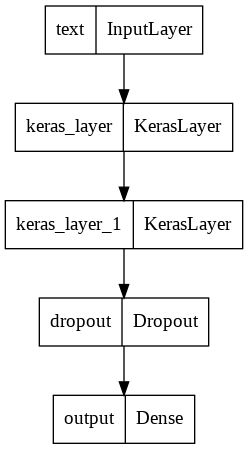

# Spam-mail-detection

## Introduction

> This is a machine learning (ML) model that uses a pre-trained BERT model for spam or ham email detection.
The model was trained on a dataset of labeled emails and can be used to classify new emails as either spam or ham (non-spam).

## Prerequisites
To use this model, you will need:
- Python 
- Tensorflow 
- BERT pre-trained model
- Pandas
- NumPy

## Model Training
> The model was trained using a dataset of labeled emails. The dataset was preprocessed to clean and tokenize the emails. 
The BERT pre-trained model was fine-tuned on the dataset using Tensorflow. The model was trained using a binary cross-entropy loss function and the Adam optimizer.
The model achieved an accuracy of around 95% on the validation set.

## Model 

## Dataset

### :link: [Link](https://github.com/Sindhuinti/spam-mail-detection/blob/main/spam.csv)
